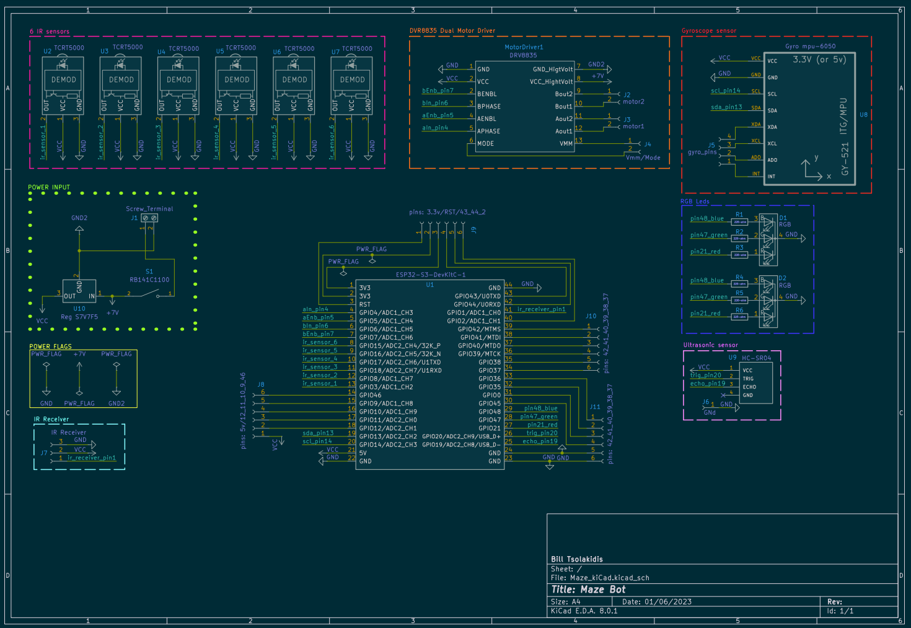
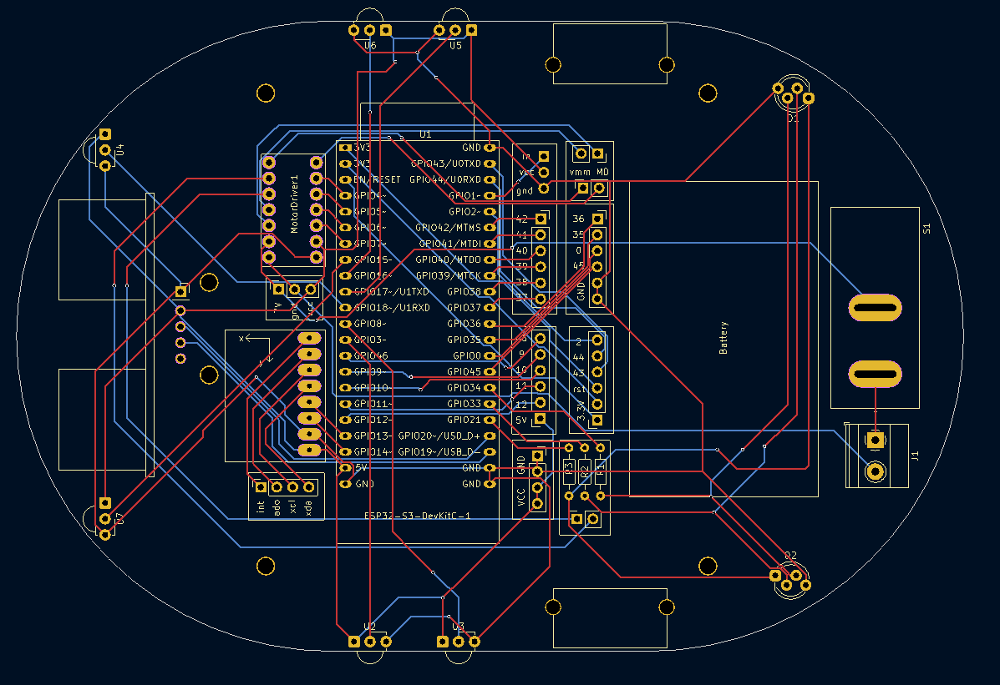
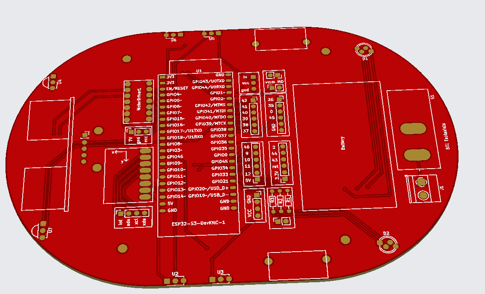
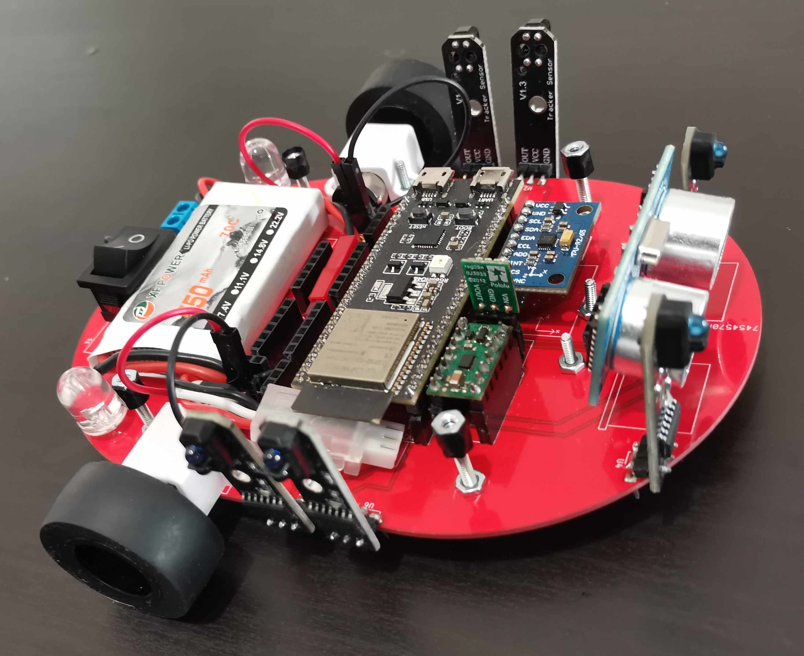

# Arduino Maze-Solving Robot

This project demonstrates how to use an Arduino board, IR sensors, and a motor driver shield to create a maze-solving robot. The robot is designed to navigate mazes by detecting, using sensors to make decisions at intersections.

## Requirements

To build this project, you will need the following components:

- ESP32 DevKit-S3
- IR sensors
- Motor driver shield
- Wheels and motors
- Jumper wires
- Battery pack
- Chassis
- Optional: Raspberry Pi (for additional functionality like 3D mapping and communication with a server)

## Circuit Diagram

## PCB

## Code

The code for this project is available in the `Maze.ino` file.

## Advanced Features

1. **Increased Size and Payload Capacity**: The robot's size can be increased to carry larger loads. This allows the robot to be used for more demanding applications, such as transporting packages or tools in industrial environments.

2. **Improved Navigation in Challenging Terrain**: The robot can be upgraded with enhanced drive systems to handle rough terrain. This feature enables the robot to navigate through more difficult environments, making it suitable for outdoor and emergency response applications.

3. **3D Mapping with LiDAR**: Adding LiDAR sensors to the robot allows it to create detailed 3D maps of its surroundings. This improves its maze-solving capabilities and makes it more versatile for tasks like underground exploration or hazardous area inspections. You can integrate LiDAR with software like ROS (Robot Operating System) and SLAM algorithms to create and visualize the 3D maps.

4. **Communication with Server using Raspberry Pi**: The robot can be connected to a server via a Raspberry Pi, enabling remote monitoring and control. This feature allows for real-time updates on the robot's progress through the maze and the ability to send and receive commands.

## Final Images

- Final pcb

- Final Mazo robot

